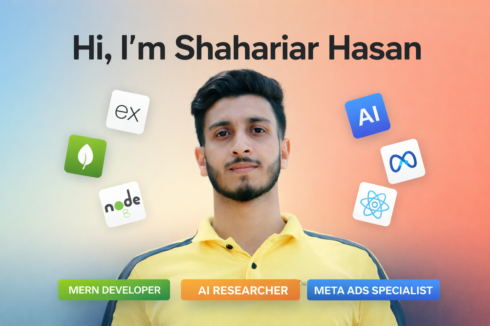

  

As a **running CSE student at United International University**, I bridge the gap between academic research and real-world business growth. I don't just study algorithms; I build intelligent, scalable systems designed to convert and perform.

---

### 🔭 What I’m Doing Currently

* **Deepening AI Integration:** Researching ways to integrate **LLMs (Large Language Models)** into MERN applications to create more intuitive, "agentic" user interfaces.
* **Advanced Tracking Systems:** Mastering **Server-Side GTM** implementations to bypass browser tracking limitations (iOS 14+) for high-scale e-commerce brands.
* **Open Source Contribution:** Refactoring my **RecipeHub** backend to support microservices architecture for better scalability.
* **Continuous Learning:** Diving deeper into **System Design** and **Advanced SQL** to complement my NoSQL expertise.

---
### 🛠️ Technical Arsenal

| Category | Technologies |
| :--- | :--- |
| **Languages** |     |
| **Full-Stack (MERN)** |     |
| **AI Research** |     |
| **Meta Marketing** |     |
| **CSE Fundamentals** |     |

---
### 📈 Where My Worlds Collide
I specialize in **Technical Marketing Engineering**—using my CSE background to implement advanced tracking (Server-Side GTM), AI-driven audience segmentation, and high-converting landing pages.

---

###  Key Projects

** E-Commerce Backend API**
* **Tech:** Node.js, Express, MongoDB.
* **Core:** Implemented **RBAC** (Role-Based Access Control), complex **Aggregation Pipelines** for product filtering, and **Indexing** for search optimization.

** Deepfake Voice Detection (Thesis)**
* **Tech:** Python, PyTorch, Librosa, Transformers.
* **Core:** A deep learning framework analyzing MFCCs and spectral features to detect synthetic audio artifacts with high precision.

---

### 🧪 Featured Projects

#### 🔊 [Deepfake Voice Detection (Thesis)](https://github.com/shahariarhasanlimon)
*Deep Learning framework to identify synthetic audio artifacts.*
* **Core:** Analyzes MFCCs and spectral features via PyTorch and Transformers to detect AI-generated audio.
* **Tech:** Python, Librosa, PyTorch.

#### 🥘 [RecipeHub - Microservices Social SaaS](https://github.com/shahariarhasanlimon/RecipeHub_backend)
*A high-concurrency social platform for food enthusiasts.*
* **Impact:** Implementing real-time WebSockets and refactoring to microservices for horizontal scaling.
* **Tech:** Django (DRF), React, WebSockets, SSLCommerz.

#### 📝 [QuizZone - Automated Examination](https://github.com/shahariarhasanlimon/quiz_zone_backend)
*Secure, automated marking system with real-time leaderboards.*
* **Impact:** Built a robust auth-to-email verification flow and dynamic PostgreSQL ranking algorithms.
* **Tech:** Django, PostgreSQL, Email-Auth.

---

### 📊 Performance Metrics

  
  

  

---

### 🏆 Motivation & Philosophy
> *"First, solve the problem. Then, write the code."* — John Johnson

I believe the future belongs to the **"T-Shaped Engineer"**—someone with deep technical expertise in code who also understands the business metrics that code is meant to drive.

### 🔎 Let's Connect!

  
  
  

---
